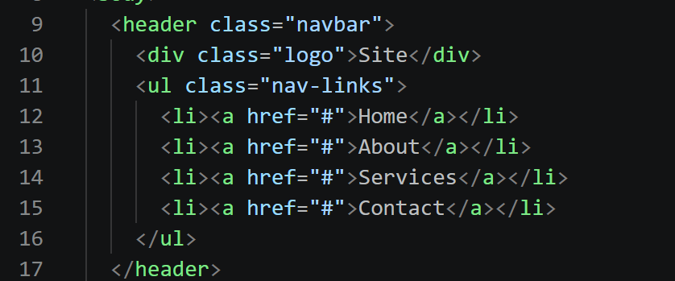
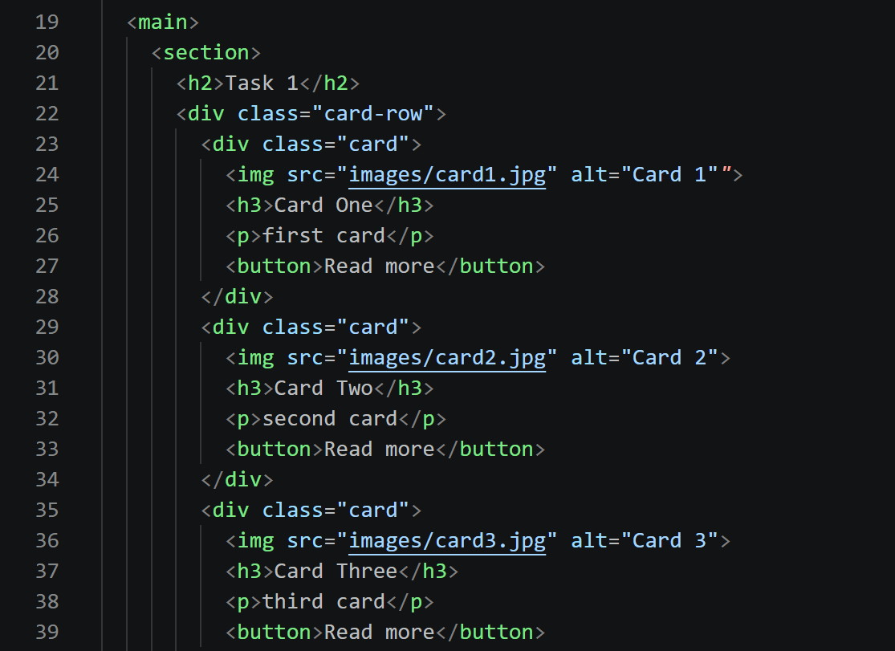
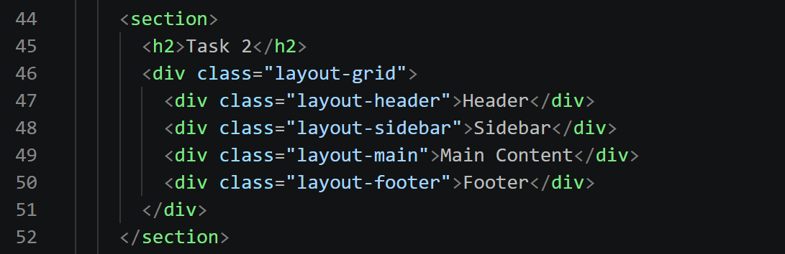
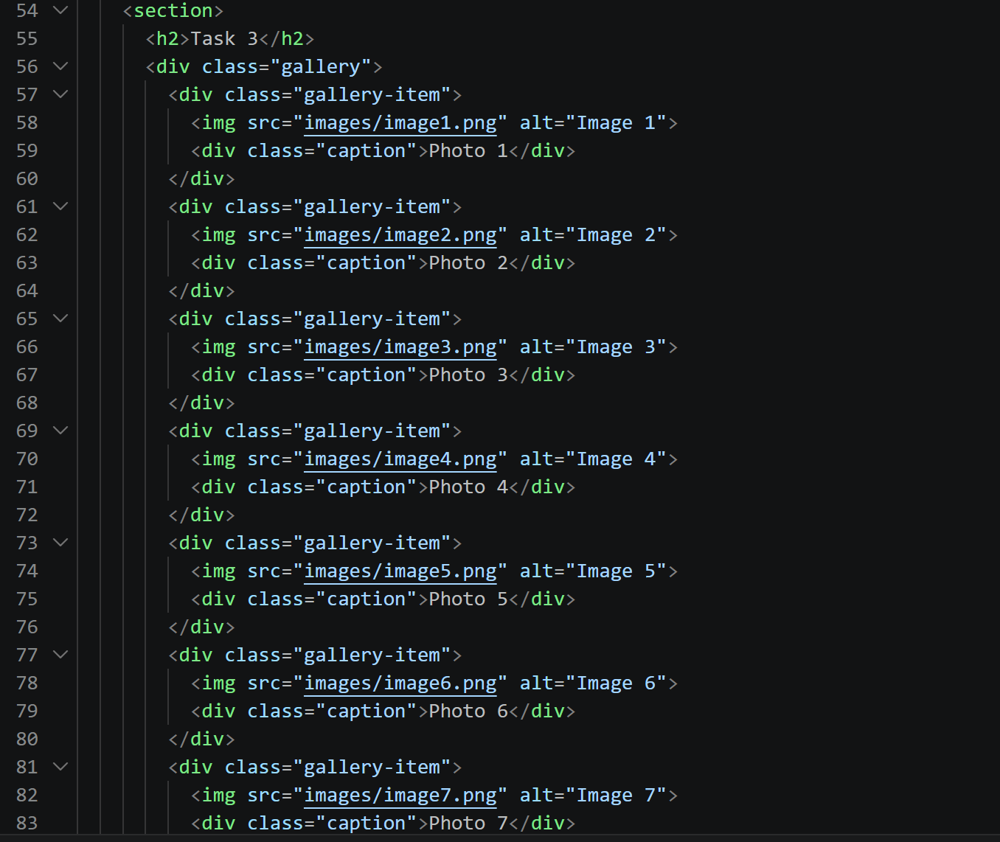
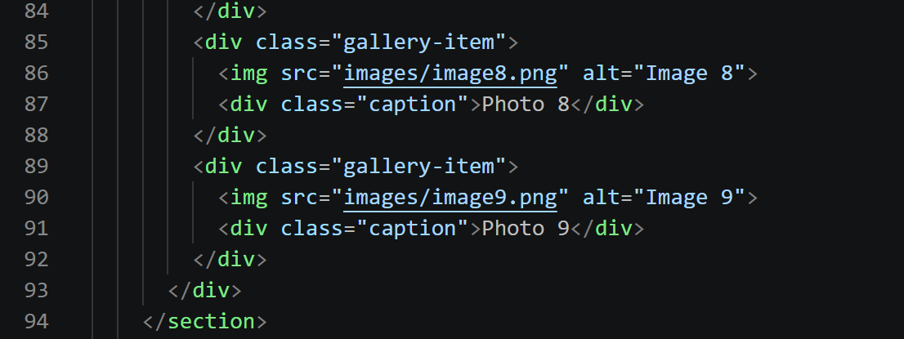
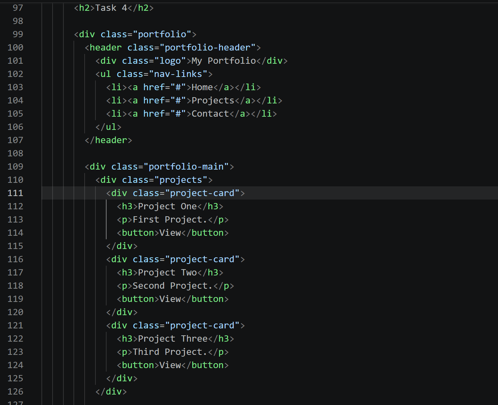

# Assignment #2

**Name:** Aidar Murat
**Group:** SE - 2539

## Task 0. Navigation Bar
Header with a logo on the left and nav links on the right, using Flexbox for alignment and spacing.

![Navigation Bar]

## Task 1. Card Row
Three cards in a row (image, title, text, button) with equal height, equal gaps, and a hover effect, using Flexbox.

![Card Row]

## Task 2. Page Layout with Grid Areas
Header, sidebar, main content, and footer arranged with CSS Grid using grid-template-areas.

![Page Layout]

## Task 3. Image Gallery
Nine images placed in a grid with equal columns, consistent gaps, and a caption overlay on hover.

![Image Gallery]

## Task 4. Portfolio Page
Full page combining Flexbox (header nav, project card content) and Grid (main section: projects + sidebar).

![Portfolio Page]

## Summary of Work Process
I built the layouts step by step, starting with the navigation bar and cards using Flexbox, then the page layout and gallery using CSS Grid. Finally, I combined both techniques in the portfolio page. I tested each section in the browser to make sure the alignment, spacing, and hover effects worked correctly.
